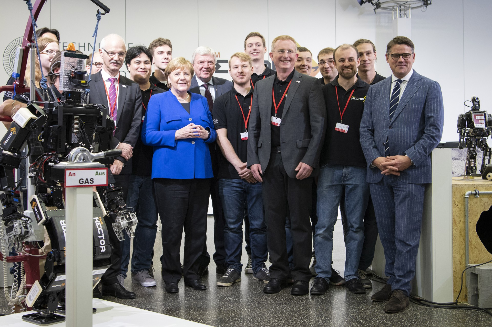

---
# Feel free to add content and custom Front Matter to this file.
# To modify the layout, see https://jekyllrb.com/docs/themes/#overriding-theme-defaults

layout: home
---

# Team Hector

Team Hector is a mixed team of students and PhD candidates at the Technical University of Darmstadt supporting human first responders in disasters by researching and developing intelligent search-and-rescue robots.
Our rescue robots and algorithms are designed to be deployed in harsh and hazardous environments such as partially collapsed buildings. They support local responders by autonomously exploring unknown environments, performing manipulation tasks, creating 2D and 3D maps, and generating a situation overview with localized victims and hazard materials.
We develop and evaluate our methods tightly coupled to actual first responders in research projects such as the German Center for Rescue Robotics and emergenCITY. 
The robustness of our solutions is regularly and very successfully demonstrated in international robotics competitions such as the RoboCup Rescue League, EnRicH, World Robot Summit, and the DARPA Robotics Challenge.

Team Hector emerged from the former world-champion robot soccer Team Darmstadt Dribblers and was started in 2009 as an interdisciplinary effort of researchers from TU Darmstadt's Computer Science and Mechanical Engineering Departments within the PhD program GRK 1362. Its current team members are PhD students from Computer Science and students of the bachelor and master programs in Autonomous Systems, Computer Science, Computational Engineering, Information Systems Technology, Mechanical Engineering, Mechatronics, and Electrical Engineering. 

Team Hector is always looking for new members. If you are interested in working with us, take a look at our [Join us](join-us) page!

  
**German chancellor Angela Merkel visiting Team Hector at TU Darmstadt (2018).**

Some of the team's achievements are:

* 2021: Best 3D Mapping and Best Radiation Mapping Awards of [ENRICH](https://enrich.european-robotics.eu/)
* 2021: Winner and Best in Class Exploration of the RoboCup Rescue German Open DRZ Edition
* 2021: Best in Class Dexterity and Best in Class Exploration and Mapping of RoboCup Rescue World Championship
* 2019: Best in Class Exploration, Outdoor CarryBot and 3rd place of RoboCup Rescue World Championship
* 2019: Best in Class Mapping of [ENRICH](https://enrich.european-robotics.eu/)
* 2018: Winner of the Plant Disaster Challenge at the [World Robot Summit](http://worldrobotsummit.org/) in Tokyo
* 2018: Best in Class Exploration, Outdoor CarryBot and Small Robot Awards of RoboCup Rescue World Championship
* 2017: Winner of the [ARGOS Challenge](http://www.argos-challenge.com/en) with Team ARGONAUTS
* 2017: Best in Class Radiation Mapping of [ENRICH](https://enrich.european-robotics.eu/)
* 2016, 2017: Best in Class Micro Aerial Vehicle of RoboCup Rescue League
* 2015, 2014, 2013, 2012: Best in Class Autonomy Award of RoboCup Rescue Robot League
* 2015: Finalist of the prestigious [DARPA Robotics Challenge](http://www.theroboticschallenge.org/)
* 2014: Champion of RoboCup Rescue Robot Legue
* 2013: Release of [Hector Navigation](http://wiki.ros.org/hector_navigation) and further open-source software for search and rescue robots
* 2013: HARTING Open Source Award for Hector SLAM
* 2012: Open source release of [Hector SLAM](http://wiki.ros.org/hector_slam)
